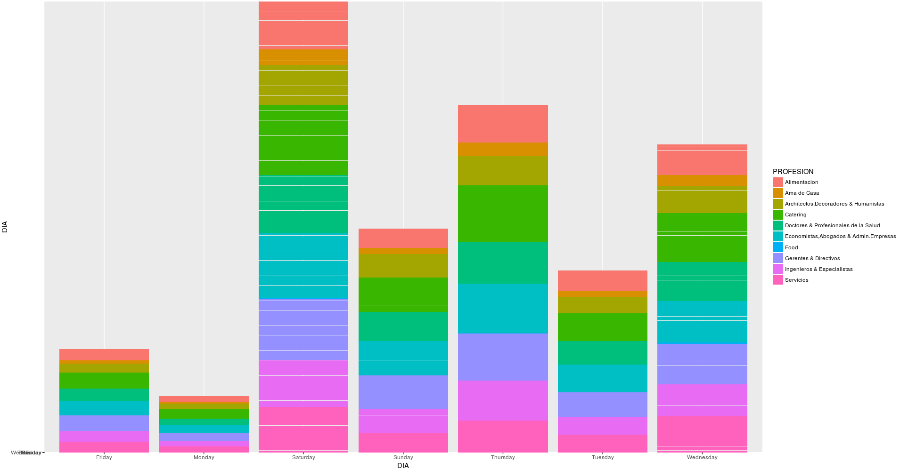

# Gourmet Analysis with R

Analysis with R to sample dataset to Gourmet supermarkets

````
Gourmet Project
 ├── R  # anàlisis i models de la practica
 │   ├── analisis_data_o_hora_del_dia.R
 │   ├── analisis_volum_de_vendes.R
 │   ├── analisis_per_import_total.R
 │   ├── model_agregation_rules.R
 │   └── model_decision_tree.rpart.R
 │   
 ├── images  # directori on hi ha imatges generades amb R
 │   
 ├── csv  # datasets per cada script .R
 │   ├── analisis_data_o_hora_del_dia.csv
 │   ├── analisis_volum_de_vendes.csv
 │   ├── analisis_per_import_total.csv
 │   ├── model_agregation_rules.csv
 │   └── model_decision_tree.rpart.csv
 │   
 ├── SQL    # sentencies sql les qual s'han creat els csv
 │   ├── analisis_data_o_hora_del_dia.sql
 │   ├── analisis_volum_de_vendes.sql
 │   ├── analisis_per_import_total.sql
 │   ├── model_agregation_rules.sql
 │   └── model_decision_tree.rpart.sql
 │
 ├── mysql   # script per crear la base de dades, requereixen del csv de la practica
 │   ├── GourmetDB.db2
 │   └── GourmetDB.sql  # adaptar per a mysql, importa els csv original de la practica
 │ 
 ├── Index_documents_practica.txt   # index de la practica
 └── acostasg_MD_Practica.pdf       # pdf explicació practica i les respostes amb gràfics per al client.
 ````
 
 
 
### Kaggle: Your Home for Data Science
 
 Dataset: https://www.kaggle.com/acostasg/gourmet-supermarkets
 
##### Kernels:
* https://www.kaggle.com/acostasg/analysis-by-day-and-time
* https://www.kaggle.com/acostasg/analysis-by-purchasing-number
* https://www.kaggle.com/acostasg/analysis-of-the-total-amount-of-purchases
* https://www.kaggle.com/acostasg/model-decision-tree
* https://www.kaggle.com/acostasg/model-agregation-rules
